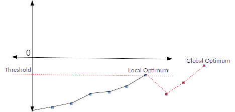

# Hill Climber Algorithm

## Installation
Ensure to copy the hill_climber.go file into your go path and run it:

````
cp hill_climber.go $GOPATH/some_folder
cd $GOPATH/some_folder
go run hill_climber.go
````

## Travelling Salesman Problem
The Traveling Salesman Problem (TSP) presents a challenge whereby the goal is to determine the shortest distance to travel 
in order to visit *n* cities and to return back to the starting point. 

What is interesting to us is not in fact the actual solution to the problem (the shortest distance), but instead, to improve the 
optimal path until a pre-defined criteria is met, with which we would be happy with (e.g. any lap under 5000 km in total). 

In order to meet the criteria, we are able to use a *heuristic* approach.

A **Heuristic approach**, in terms of this particular problem, means that we start off 
from a random city and that any step we take either improves or decreases the result until we are happy.

## Implementation

In order to define the problem we require a few things.

### Define the Cities and the Distances Between Them
In order for us to have a basis to work on, we initiate a m X m **hollow matrix**, i.e. 100 cities:


|                   |c<sub>1</sub>|c<sub>2</sub>|c<sub>...</sub>|c<sub>n</sub>|
|:-----------------:|:-----------:|:-----------:|:-------------:|:-----------:|
|**c<sub>1</sub>**  |0            |13           |...            |23           |
|**c<sub>2</sub>**  |33           |0            |...            |17           |
|**c<sub>...</sub>**|89           |12           |...            |23           |
|**c<sub>n</sub>**  |22           |25           |...            |0            |  

The reason this matrix is hollow, is because the distance between same cities, is naturally 0.

### Define a Hypothesis
Due to us taking a heuristic approach, we require a starting point. In this case, we setup an array
with the length m (representing each individual city in our matrix), which is initially filled with numbers corresponding to the array's 
indexes...

````
[0, 1, 2, ..., n]
````

... which is then randomly shuffled in order to become our initial hypothesis

````
[2, 0, n, ..., 1]
````

**Hypothesis** therefore means, we start of saying "This is the shortest distance between all the cities".

### Define a Fitness Criteria
By now we have a map of cities (matrix) and a path through all of them (hypothesis). 

The question remains what criteria we are basing the result's performance on. This is easy, as it is the total distance 
travelled by our hypothesis. So for every city in our hypothesis, we obtain the distance between it and its next city 
from the map we created. Additionally we calculate the distance between the last city and the starting city, as we are
performing a complete lap (we need to return home at the end of the journey).

**NOTE:** The fitness is usually a value that is meant to "increase", however the goal in TSP is to have the total distance decrease. 
Therefore, instead of summing up the distances, we subtract them from each other.

## The Algorithm
Now that a city map, hypothesis and the fitness criteria has been established, it's time to breathe some life into the 
algorithm in order to apply the hill climber soltion to the TSP problem:

1. Establish a Threshold to define an exit criteria [ie. 2000km] and negate it (see above why)
1. Initiate city map / matrix 
1. Initiate the hypothesis
1. Enter loop with THRESHOLD > FITNESS:
    1. Obtain a (deep )copy of the current hypothesis
    2. Swap two random positions in the hypothesis [Thus, taking a step]
    3. Obtain fitness based on copied hypothesis
        1. If the fitness is better than the current fitness, set the copied hypothesis as the new hypothesis
        2. Else, discard the copy of the hypothesis and re-enter the loop with the original

## Conclusion
Seeing as we only replace a hypothesis if the mutated copy yields a better fitness, we can see that the hill-climber
**only takes a step if the result is better**.

## Major Disadvantage
Only taking a step based on a better fitness can lead to the algorithm getting stuck  in
a local optimum without having the chance of reaching a global optimum:




However, this issue is addressed by amending the algorithm to be implemented utilising [Simulated Annealing](../simulated_annealing).


