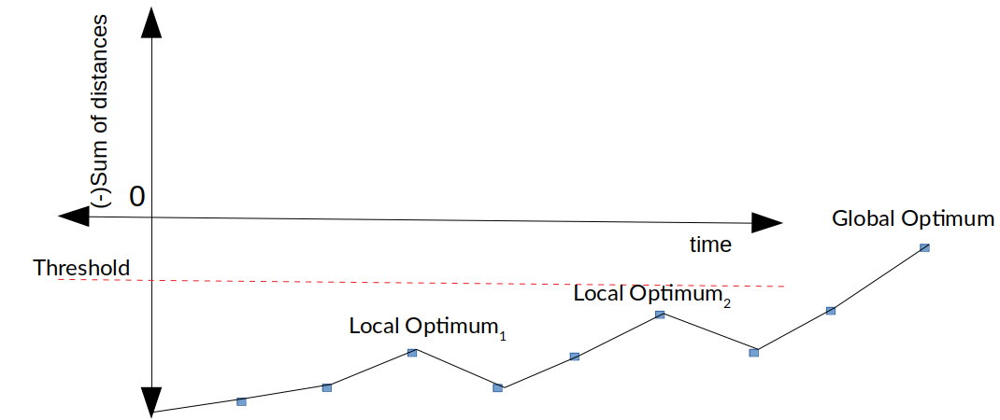

# Simulated Annealing Algorithm

## Installation
Ensure to copy the simulated_annealing.go file into your GO path and run it:

````
cp simulated_annealing.go $GOPATH/some_folder
cd $GOPATH/src/<some_folder>
go run hill_climber.go
````

## Hill Climber Algorithm
**Simulated Annealing** is a strategy to improve the previously introduced [Hill Climber Algorithm](../hill_climber). 
It intends to prevent getting stuck in a local optimum as well as to be able to end up in multiple local optimums.

The term **annealing** comes from the field of metallurgy, whereby metals are heated up by a certain temperature in order to cool down
over an extended period of time, allowing the formation of crystals and thus making the metals more ductile and workable.

In terms of improving the hill climber, this approach enables us to inspect a larger neighbourhood of fitness results.
This is achieved by occasionally accepting a fitness which is of less value to us than the current fitness in order to escape 
a local optimum [thus climbing down].

The probability of accepting a less favourable fitness is defined by:


**f(y)**: Specifies the new fitness

**f(x)**: Specifies the current fitness

**T**: Temperature starts off high and steadily declines

If the new fitness is smaller than the current fitness the probability is somewhere between 0 to 1 due to the e-function.
Initially, the e-function will return values close to 1, however, as the temperature decreases, it will tend to go towards 0, 
thus it becomes less likely that a less favourable fitness ends up being set as the current fitness.

Much like with the metal, initially the values are free to move. As the temperature decreases, the process adapts to 
become more like the original hill climber, thus only taking steps when a better fitness is obtained.



## Implementation
As with the original [Hill Climber Algorithm](../hill_climber), we have a m X m matrix representing the distances between
the cities, a hypothesis which we accept as the current shortest distance to be travelled and a fitness calculation
based on the total distance travelled in an entire lap.

1. Establish a Threshold to define an exit criteria [ie. 2000km] and negate it (see above why)
1. Initiate city map / matrix 
1. Initiate the hypothesis
1. Enter loop with THRESHOLD > FITNESS:
    1. Obtain a (deep )copy of the current hypothesis
    2. Swap two random positions in the hypothesis [Thus, taking a step]
    3. Obtain fitness based on copied hypothesis
        1. If the fitness is better than the current fitness, set the copied hypothesis as the new hypothesis
        2. Else, **generate a random value between 0..1 and compare with the probability resulting from the annealing function**
            1. If the random value is *smaller* than the probability, set the less favourable fitness as the current fitness
    1. Decrease the temperature by epsilon (epsilon = small value e.g. 0.01)

## Conclusion
By incorporating the Simulated Annealing strategy into the Hill Climber Algorithm, we are able to expand the fitness neighbourhood
in order to counteract the chances of landing in an unfavourable local optimum. While, this strategy is by no means a silver
bullet in finally landing in the global optimum, it does expand the chances of reaching a better threshold.